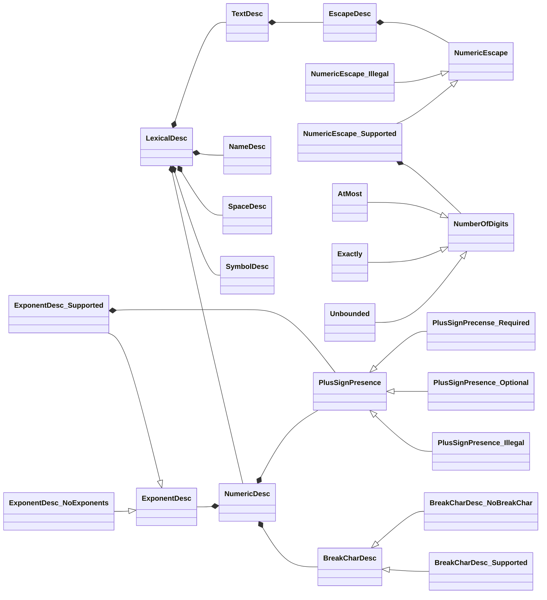



# Configuring the Lexer (`parsley.token.descriptions`)

## Diagram of Dependencies

```mermaid
classDiagram
direction LR

LexicalDesc *-- NumericDesc
LexicalDesc *-- NameDesc
LexicalDesc *-- SpaceDesc
LexicalDesc *-- SymbolDesc
LexicalDesc *-- TextDesc

TextDesc *-- EscapeDesc
EscapeDesc *-- NumericEscape
NumericEscape_Illegal --|> NumericEscape
NumericEscape_Supported --|> NumericEscape
NumericEscape_Supported *-- NumberOfDigits
AtMost --|> NumberOfDigits
Exactly --|> NumberOfDigits
Unbounded --|> NumberOfDigits

ExponentDesc --* NumericDesc
ExponentDesc_Supported --|> ExponentDesc
ExponentDesc_NoExponents --|> ExponentDesc
NumericDesc *-- BreakCharDesc
ExponentDesc_Supported *-- PlusSignPresence

BreakCharDesc <|-- BreakCharDesc_Supported
BreakCharDesc <|-- BreakCharDesc_NoBreakChar

PlusSignPresence <|-- PlusSignPresence_Illegal
PlusSignPresence <|-- PlusSignPresence_Optional
PlusSignPresence <|-- PlusSignPrecense_Required
NumericDesc *-- PlusSignPresence


```
