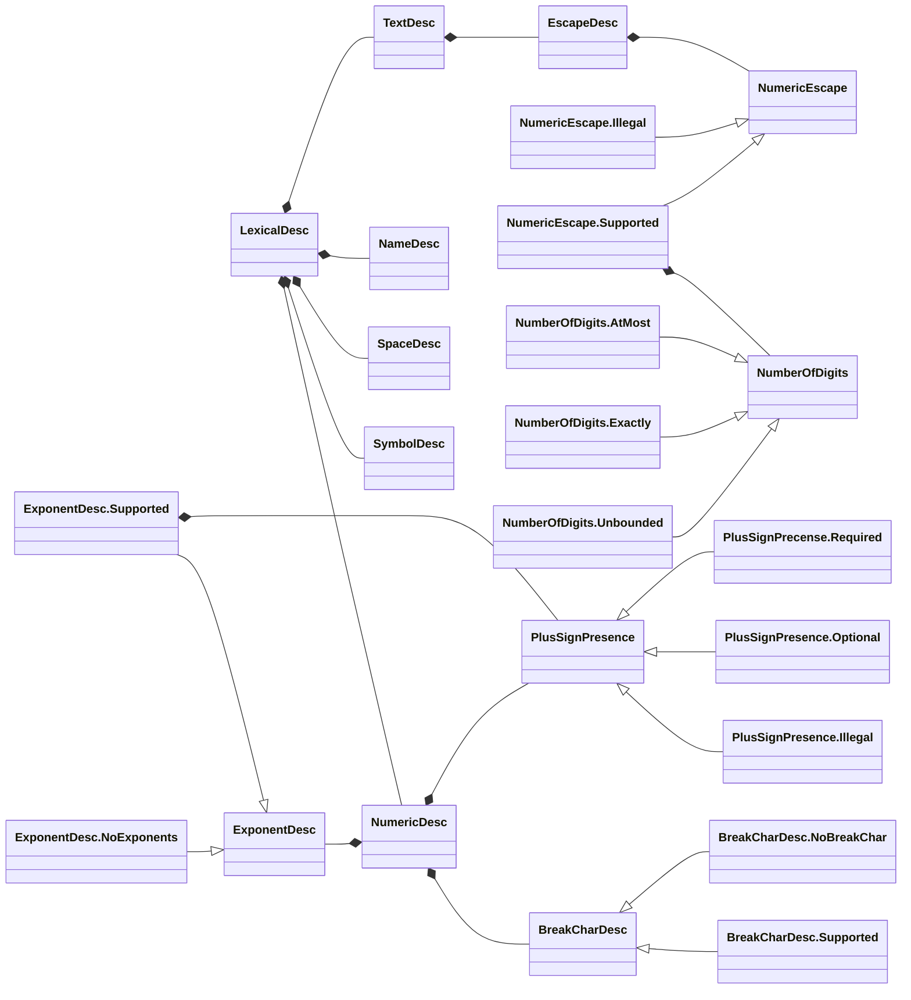



# Configuring the Lexer (`parsley.token.descriptions`)
The [`Lexer`][Lexer (`parsley.token.Lexer`)] is configured primarily by providing it a
[`LexicalDesc`](@:api(parsley.token.descriptions.LexicalDesc)). This is a structure built up
of many substructures that each configure a specific part of the overall functionality available.
In general, many parts of this hierarchy have "sensible defaults" in the form of their `plain` value
within their companion objects; these document what choices were made in each individual case. There
may also be some values crafted to adhere to some specific language specification; for instance,
`EscapeDesc.haskell` describes escape characters that adhere to the Haskell Report.

This page does not aim to document everything that is configurable within `LexicalDesc`, but it will
outline the general design and how things slot together.

## Diagram of Dependencies
The hierarchy of types involved with lexical configuration can be daunting. The following diagram
illustrates both the "has-a" and "is-a" relationships between the types. For instance, `TextDesc`
contains an `EscapeDesc`, and `NumericEscape` may be implemented by either `NumericEscape.Illegal` or
`NumericEscape.Supported`.

The types in the diagram that have alternative implements are as follows:

* `BreakDescChar`: used to describe whether or not numeric literals can contain meaningless
  "break characters", like `_`. It can either be `NoBreakChar`, which disallows them; or
  `Supported`, which will specify the character and whether it is legal to appear after a non-decimal
  prefix like hexadecimal `0x`.
* `PlusSignPresence`: used to describe whether or not a `+` is allowed in numeric literals, which
  appears for the start of numeric literals and floating-point exponents. It can either be `Required`,
  which means either a `+` or `-` must always be written; `Optional`, which means a `+` can be written;
  or `Illegal`, which means only a `-` can appear.
* `ExponentDesc`: used to describe how an exponent is formed for different bases of floating point
  literals. It can either be `Supported`, in which case it will indicate whether it is compulsory,
  what characters can start it, what the numeric base of the exponent number itself is, and then
  what the `PlusSignPresence` is, as above; otherwise, it is `NoExponents`, which means that the
  exponent notation is not supported for a specific numeric base.
* `NumericEscape`: used to describe whether or not numeric escape sequences are allowed in string and
  character literals. It either be `Illegal`, which means there are no numeric escapes; or `Supported`,
  which means that the prefix, `NumberOfDigits`, and the maximum value of the escape must all be
  specified.
* `NumberOfDigits`: used by the above `NumericEscape` to determine how many digits can appear within
  a numeric escape literal. These can be one of: `Unbounded`, which means there can be any well-formed
  number as the escape; `AtMost`, which puts an upper limit on the number of digits that can appear;
  or `Exactly`, which details one or more exact numbers of digits that could appear, for instance,
  some languages allow for numeric escapes with exactly 2, 4, or 6 digits in them only.
