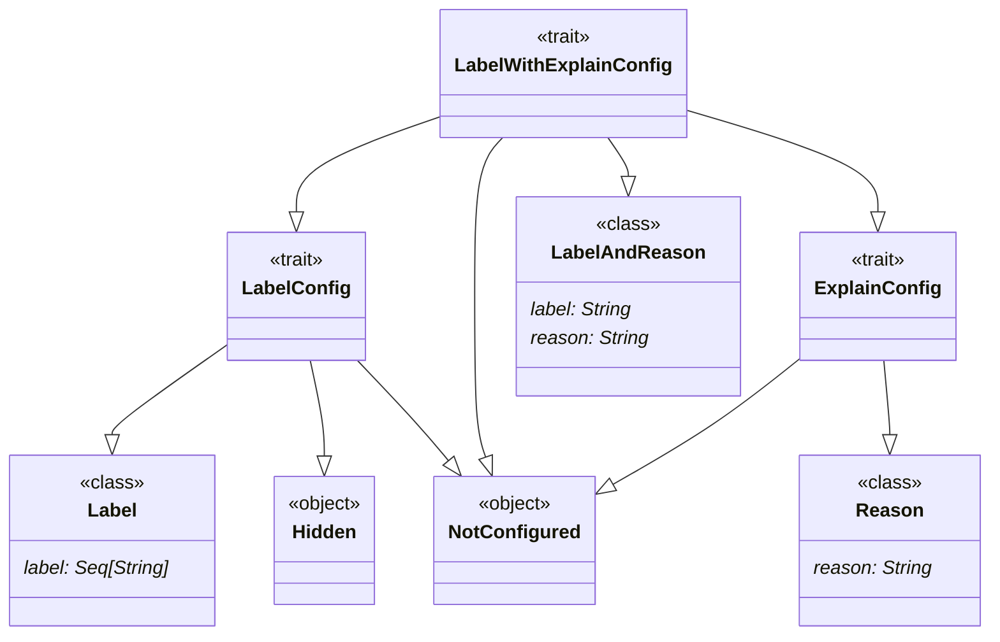
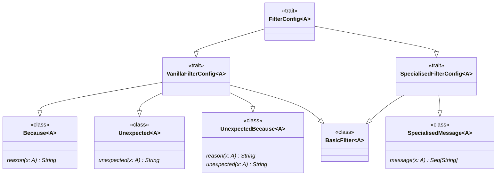



# Configuring Errors (`parsley.token.errors`)
The default error messages generated by the parsers produced by
the `Lexer` are *ok*, but can be much improved.

## `errors.ErrorConfig`
The [`ErrorConfig`](@:api(parsley.token.errors.ErrorConfig)) class is where all the
configuration for error messages generated by the `Lexer` resides. Everything in
this class will have a default implementation (nothing is abstract); this ensures
easy backwards compatibility. Each of the configurations
inside takes one of the following forms:

* A plain `String` argument, usually indicating a name of a compulsory label.
* A [`LabelConfig`][Configuring Labels], which can either be unconfigured, hidden,
  or a regular label name.
* A [`LabelWithExplainConfig`][Adding Explanations], which augments the previous
  configuration to also allow for a reason to be added, if desired.
* A [`FilterConfig`][Configuring Filtering], or one of its specific subtypes,
  which can be used to handle the messages for ill-conforming data.
* A [special configuration], which is used for very specific error messages, usually
  arising from one of the more advanced error patterns (see [Advanced Error Messages])

## Configuring Labels and Explains
Labels are one of the most common additional error configurations that can be applied
throughout the pre-made lexer parsers. Some, but not all, of these labels can be configured
to also produce a *reason* if the configuree cannot be parsed (either for why it should be
there or what it requires). The hierarchy of components is visualised by the following
UML diagram:

Broadly, a component may either be marked as a `LabelWithExplainConfig`, which
means it can contain either labels, reasons, or both; `LabelConfig` if a reason
wouldn't make sense; and a `ReasonConfig` if it does not make sense to name.

### Configuring Labels

### Adding Explanations

## Configuring Filtering

## Special Configuration
