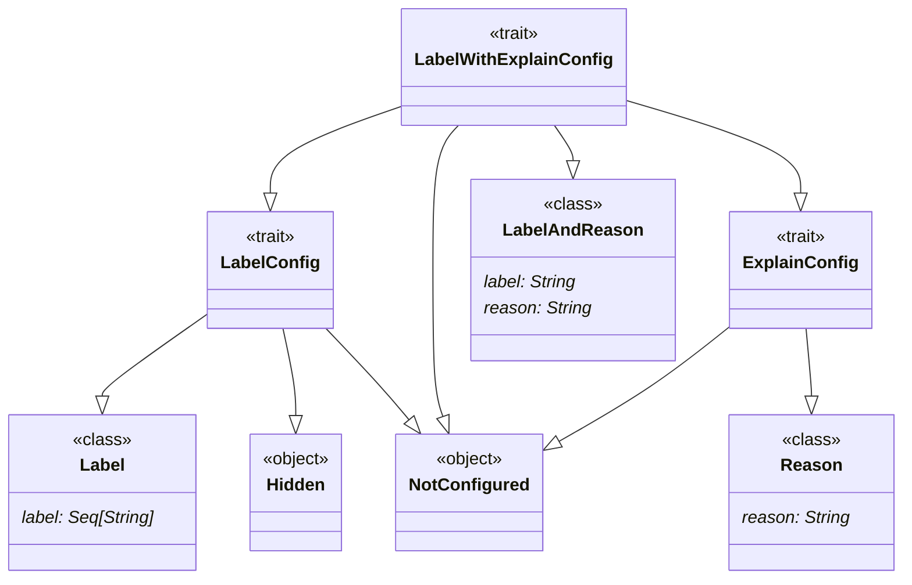
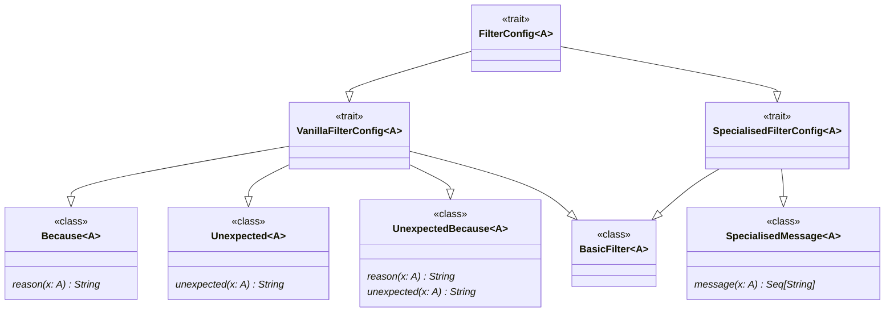



# Configuring Errors (`parsley.token.errors`)
The default error messages generated by the parsers produced by
the `Lexer` are *ok*, but can be much improved.

## `errors.ErrorConfig`
The [`ErrorConfig`](@:api(parsley.token.errors.ErrorConfig)) class is where all the
configuration for error messages generated by the `Lexer` resides. Everything in
this class will have a default implementation (nothing is abstract); this ensures
easy backwards compatibility. Each of the configurations
inside takes one of the following forms:

* A plain `String` argument, usually indicating a name of a compulsory label.
* A [`LabelConfig`][Configuring Labels], which can either be unconfigured, hidden,
  or a regular label name.
* A [`LabelWithExplainConfig`][Adding Explanations], which augments the previous
  configuration to also allow for a reason to be added, if desired.
* A [`FilterConfig`][Configuring Filtering], or one of its specific subtypes,
  which can be used to handle the messages for ill-conforming data.
* A [special configuration], which is used for very specific error messages, usually
  arising from one of the more advanced error patterns (see [Advanced Error Messages])

## Configuring Labels and Explains
Labels are one of the most common additional error configurations that can be applied
throughout the pre-made lexer parsers. Some, but not all, of these labels can be configured
to also produce a *reason* if the configuree cannot be parsed (either for why it should be
there or what it requires). The hierarchy of components is visualised by the following
UML diagram:

Broadly, a component may either be marked as a `LabelWithExplainConfig`, which
means it can contain either labels, reasons, or both; `LabelConfig` if a reason
wouldn't make sense; and a `ReasonConfig` if it does not make sense to name.

### Configuring Labels
Adding a label can be one of the following:

* `Label`: this labels the corresponding parser with one or more
           labels -- this also applies for `LabelAndReason`.
* `Hidden`: this suppresses any error messages arising from the
            corresponding parser.
* `NotConfigured`: this doesn't alter the error messages from
                   the corresponding parser.

### Adding Explanations
Adding an explanation can be one of the following:

* `Reason`: this adds a reason for the corresponding parser
            though doesn't change the labelling -- unless `LabelAndReason` is used instead.
* `NotConfigured`: this doesn't alter the error messages from
                   the corresponding parser.

## Configuring Filtering
Some parsers perform filtering on their results, for instance checking if a numeric literal
is within a certain bit-width. The messages generated when these filters fail is controled
by the `FilterConfig[A]`, where `A` is the type of value being filtered. The below diagram
shows how the various sub-configurations are laid out.

Some filters within the `Lexer` are best left as a *specialised* or *vanilla* error, which is
why the hierarchy is constrained. Other than that, the various leaf classes allow for various
combinations of adding reasons, altering the unexpected message, or bespoke error messages.
The `BasicFilter` here does not attach any special error messages to the filtering, having the
effect of just using the basic `filter` combinator internally.

## Special Configuration
Some parts of the error configuration for the `Lexer` are special. In particular, these are
`preventRealDoubleDroppedZero` and the two `verifiedXBadCharsUsedInLiteral` (for both `Char` and `String`).
These provide very hand-crafted error messages for specific scenarios, based on the ideas of
the *Preventative* and *Verified Errors* patterns.

### Preventing Double-Dropped Zero
When writing floating point literals, it is, depending on the configuration, possible to write `.0`,
say, or `0.`. However, it should not be possible to have the literal `.` on its own! Overriding
`preventRealDoubleDroppedZero` is the way to prevent this, and provide a good error message in the
process. There are a few options:

* `UnexpectedZeroDot`: sets an unexpected message when just `.` is seen to be the given string.
* `ZeroDotReason`: does not set an unexpected message, but adds a reason explaining why `.` is illegal.
* `UnexpectedZeroDotWithReason`: combines both above behaviours.
* `ZeroDotFail`: throws an error with the given bespoke error messages.

### Preventing Bad Characters in Literals
When writing string and character literals, some characters may be considered illegal. For instance,
a langauge may not allow `"` to appear unescaped within a character literal. To help make it clear
why a character was rejected by the parser, `verifiedCharBadCharsUsedInLiteral` and
`verifiedStringBadCharsUsedInLiteral` allow for fine-grained error messages to be generated when
an illegal character occurs. There are a few options:

* `BadCharsFail` takes a `Map[Int, Seq[String]]` from unicode characters to the messages to generate
  if one of the keys was found in the string.
* `BadCharsReason` takes a `Map[Int, String]` from unicode characters to the reason they generate if
  they are found in the string.
* `Unverified` does no additional checks for bad characters.
